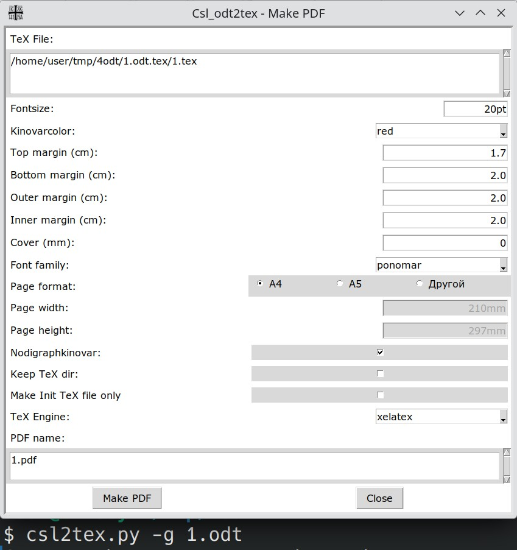
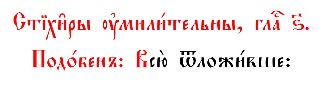
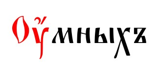
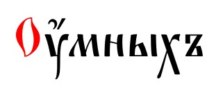

# csl_odt2tex

**Оформление документов с текстом на церковно-славянском языке.**

## Общая информация

Исходный документ оформляется в `Libre Office` в соответствии с набором стилей, представленных в шаблоне `Гимнография 20 новый.ott`.  
В ч/б версии _киноварь_ заменена на **bold black** начертание.  
Далее документ можно конвертировать в `TeX` файл для дальнейшей компиляции - либо в качестве отдельного самостоятельного документа, либо в составе сборника-книги. См. [Wiki](https://github.com/EliseyP/csl_odt2tex/wiki).  

Промежуточный `.init.tex` файл позволяет сохранить изменения сделанные в итоговом `.tex` файле при повторной конвертации из `.odt.` Изменения отслеживать и вносить (из `.init.tex` в `.tex`) можно такими средствами как `meld, kdiff3` и т.п.

Для `TeX`-компиляции (`xelatex, lualatex`) используются класс документа `churchslavichymnsbook.cls` и стилевой файл `churchslavichymn.sty`.  
В классе `churchslavichymnsbook.cls` загружается `KOMA-Script` класс `scrbook`. Также возможно задать некоторые параметры книги (размеры, поля и т.п.).   
При использовании стилевого файла `churchslavichymn.sty` отдельно, класс `scrbook` необходимо указать **явно.** 

Опцией `single=true` пакета `churchslavichymn.sty` задается компиляция в качестве отдельного самостоятельного документа. Это влияет в основном на колонтитулы и компоновку оглавления. По умолчанию `single=false` - сборка книги. 

Изначально в данной системе оформления использовалась база данных, в которой в числе прочего для каждого документа указан `Заголовок` - для колонтитула и оглавления, и `ЗаголовокРусский` - для `PDF`-закладок (макросы `\TITLE` и `\TITLERU` как параметры макроса `\section`, через макрос `\TOCENTRY`).  
Эти заголовки могут быть указаны в качестве параметров `title` и `title_ru` для функции `csl_odt2tex()` в скрипте `convert.py`.   
Причем, при отсутствии этих параметров их можно получить из `user-defined` полей `odt`-документа (см. ниже). 

## ODT шаблоны

Шаблоны [Гимнография 20 новый.ott]() и [Гимнография 20 новый_BLACK.ott]() созданы для оформления богослужебных книг с опорой на современные образцы. Определены стили для абзацев, символов, страниц и врезок. Нумерация страниц и оглавления - цся. 

Все абзацные ЦСЯ-стили наследуются из общего стиля первого уровня `АЗБУКИ`. Таким образом можно сменить гарнитуру для всех стилей, которые из него наследуются.

Для основного текста (`кегль = 20`) предполагается абзацный стиль, который так и называется `Основной текст` `(Text Body)`. 

Для разного рода уставных пометок, как правило красного цвета, определены стили с кеглем, на два пункта меньшим основного (`18`):
- `Устав` - выравнивание по ширине, с красной строкой.
- `Устав влево` - выравнивание влево, без красной строки.
- `Устав по центру` - выравнивание по центру.  

Для заголовков тропарей, стихир, таких как **Тропа́рь, глⷭ҇ а҃:, Богородичен:, Слава и ныне, глⷭ҇ ѕ҃:** и т.д. определен стиль `Глас`. Отличие от стиля  `Устав по центру` - **неотрывность** от следующего абзаца, то есть от текста тропаря, стихиры и т.д.

Стиль `Крест вверху` - остаток предыдущего варианта шаблона, где символ Креста для "шапки" брался из шрифта `Orthodox.tt eRoos`.

Стиль `Дата и место` - для подписи авторских текстов.

### Выделение текста киноварью 
Двумя способами: 
- Абзацными стилями: `Устав`, `Глас`, `Заглавие` (и все виды `Заголовков`) и т.д. - для выделения абзаца целиком. 
- Символьные стили: `киноварь`, `киноварь 18`, `киноварь 16`, `киноварь индикт` и т.п. - для выделения отдельных символов.    

Для **отмены киновари** у **фрагмента** текста либо с **абзацным** "киноварным" стилем (`Глас`, `Устав`), либо с **символьным** стилем группы `киноварь,` определены символьные стили со странными названиями: `киноварь черная`, `киноварь 18 черная`, `киноварь 16 черная`  и другие. Т.о. **внутри** текста с киноварным стилем оказывается фрагмент со стилем без киновари. Это дает удобство в процессе конвертации (см. макросы `\cub` и `\cuB`), а также при работе с расширением [Kinovar](https://github.com/EliseyP/Kinovar).  
_Простая заливка киноварным стилем двух отдельных фрагментов абзаца не всегда удобна, хотя иногда это лучший вариант._ 

Черно-белый шаблон - полная копия цветного, в котором красный цвет заменен на **bold black.** 

При необходимости иметь две версии документа - **цветную** и **черно-белую,** можно работать только с цветной версией, а ч/б получать автоматически, для этого есть как **oobacis-макросы,** так и **py-скрипты** (будут выложены позже). 

### Колонтитулы

Стили страниц определены для документа с различием страниц - первая, правая (нечетная), левая (четная). 

**В колонтитулах** номера страниц выставляются автоматически с учетом четности - на внешних верхних краях. Текст колонтитула (одинаковый для разворота) берется из **user-field.** 

В шаблоне определены специальные **user-defined** поля, и в числе прочего - `RunningHeader` - содержимое этого поля автоматически вставляется в колонтитулы правой и левой страницы (первая - титульная, без колонтитулов). Поле доступно для редактирования через `Меню|Файл|Свойства|Свойства пользователя`.  
Также есть `oobasic`-диалог, доступный через расширение [HymnographyCSL](https://github.com/EliseyP/HymnographyCSL), который позволяет получить текст колонтитула из `Заглавия` документа и отредактировать его.  

Остальные поля (кроме `TitleInText` при работе с диалогом `cslRunningHeaderFromTitle`) не используются _(оставлены в шаблоне для совместимости)_.  

### Расширения

Для документов с данными шаблонами возможна работа `LO`-расширений (они и были под них написаны):
- [https://github.com/EliseyP/oooInsertFW](https://github.com/EliseyP/oooInsertFW) - вставка т.н. **кустоды**. Стиль врезки определен в шаблоне. 
- [https://github.com/EliseyP/Kinovar](https://github.com/EliseyP/Kinovar) - выделение текста киноварью.   
- [https://github.com/EliseyP/HymnographyCSL](https://github.com/EliseyP/HymnographyCSL) - работа с колонтитулом, стилями; создание и конвертация в `TeX + PDF`

## Конвертация
После конвертации `TeX`-файл, как правило, готов к компиляции (его нужно вставить в `main-document`, в данном примере файлы `single.tex` и `book.tex`). Может потребоваться небольшая правка, например, параметров макросов, вставка **вертикальных шпаций** и т.п. В частности, в файле `СлужбаГосподу.init.tex` у макроса `\section` такие параметры:  
`\section[tocentry={\TOCENTRY},head={\TITLE}]{%`  
Однако при данной геометрии в оглавлении строка заголовка, которая берется из `\TITLE`, выдает `overfull hbox`. Поэтому в окончательном варианте вместо `\TOCENTRY` используется такая строка (вставлен разрыв `\\*`):   
<strong>\section\[tocentry={\texorpdfstring{\KI</strong> Слꙋ́жба со а҆ка́ѳїстомъ сладча́йшемꙋ гдⷭ҇ꙋ на́шемꙋ і҆и҃сꙋ`\\*`хрⷭ҇тꙋ<strong>}{\TITLERU}},head={\TITLE}]{</strong>%  

Также добавлена вертикальная (в данном случае отрицательная) **шпация** (`СлужбаГосподу.tex:18`): 
`\VSPACE{-.7}{-.7}%`  
перед абзацем с большой буквицей, т.к. он сильно сдвинут вниз из-за буквицы с надстрочником.  
_Два параметра у шпации `\VSPACE` - для случаев отдельного документа и книги (чтобы можно было использовать один текст для обоих случаев, без дублирования)._ 

При сборке книги команды уровня выше **\section** вставляются в **главном документе,** чтобы при повторной конвертации они не затрагивались.  

## Быстрая конвертация ODT → TEX, ODT → PDF

Скрипт `csl2tex.py` позволяет быстро получить `tex`-файл или конечный `PDF`.  

Использование (исполняемый файл `csl2tex.py` должен быть в `PATH`):  
`csl2tex.py [-g] [-b] [-p] [-d] [-T] [-I] odt-filename [odt-filename]`  

&nbsp;&nbsp;&nbsp;&nbsp;`-g      - gui make PDF dialog.`   
&nbsp;&nbsp;&nbsp;&nbsp;`-G      - только для запуска диалога из LibreOffice.`  
&nbsp;&nbsp;&nbsp;&nbsp;`-p      - make PDF.`  
&nbsp;&nbsp;&nbsp;&nbsp;`-b      - black color PDF.`  
&nbsp;&nbsp;&nbsp;&nbsp;`-T      - Не удалять TeX-каталог сборки pdf.`  
&nbsp;&nbsp;&nbsp;&nbsp;`-I      - Из ODT получать только .init.tex и также не удалять TeX каталог.`       
&nbsp;&nbsp;&nbsp;&nbsp;`-d DIR  - каталог с TeX стилями (churchslavichymn.sty etc) и прочими вспомогательными файлами (как правило, каталог, в котором находится этот скрипт).`

Сборка `PDF` происходит во временном каталоге `filename.odt.tex`. 

Файлы `.tex` и `.pdf` создаются в том же каталоге, где находится `.odt` файл.  

Результат автоматической сборки `PDF` из `odt` скорее для быстрого предварительного просмотра, т.к. после конвертации `TeX`-файл может потребовать некоторой доводки.

Для возможности промежуточного редактирования `.tex` файла, геометрии и прочего - запуск с опциями `-T` или `-I`. 
  
При запуске с опцией `-I` файл `.tex` не генерируется автоматически из `odt`, в нем сохраняются изменения, сделанные вручную. Автоматически генерируется только `.init.tex`.  
В дальнейшем с помощью инструментов сравнивания (`meld`, `kdiff3` etc) изменения в исходном `odt`, которые оказались в `.init.tex`, можно внести в `.tex` для сборки `pdf`.  
Рабочий каталог сборки - `filename.odt.tex`.  

#### Gui dialog
 

Простой диалог для быстрой компиляции PDF с возможностью поменять некоторые параметры.  

Расширение [HymnographyCSL](https://github.com/EliseyP/HymnographyCSL) позволяет запустить этот диалог из `LibreOffice` для текущего открытого документа.

## Шрифты
Основной шрифт: `Ponomar Unicode`. 

Шрифт для **русского (гражданского), греческого** и **латинского** текстов: `Noto Serif SemiBold`.  
Для **bold black** - `Noto Serif Black`.  
Для экзотического случая еврейского текста: `Arial` (необходима опция `hebrew=true` для стилевого файла `churchslavichymn.sty`). 

## TeX

Каждый документ предполагается в структуре книги как **\section-level.**  
Соответственно в стилевом файле определены команды рубрикации, аналогичные уровням **\subsection** и **\subsubsection,** `\hI` (соответствует `ODT`-стилю `Заголовок 1`) и `\hII` (соответствует `ODT`-стилю `Заголовок 2`).  
Кегль для этих заголовков (а также `\section`) определяется относительно параметра `fontsize` пакета `churchslavichymn` (по умолчанию `fontsize=20pt`). Для заголовков:  
- `\section: fontsize + 6pt,`  
- `\subsection` и `\hI: fontsize + 4pt,`  
- `\subsubsection` и `\hII: fontsize + 2pt,`  

Для книги, состоящей из нескольких документов, разделы выше уровнем задаются командами `\chapter` или `\addchap` (`\part` также доступна).  
Например (отвлеченный пример):   
`\renewcommand{\TITLE}{Мл҃твы Гдⷭ҇ꙋ}%`  
`\renewcommand{\TITLERU}{Молитвы Господу}%`  
`\addchap[tocentry={\TOCENTRY}, head={\TITLE}]{\TITLE}`  

### Текст заглавия
При оформлении `TeX`-документа текст **заглавия** используется в четырех местах. В `tex`-файле это отражается в использовании макроса `\section`. Например, абзац со стилем `Заглавие` конвертируется в блок `tex`-макросов:  
`\renewcommand{\TITLE}{А҆ка́ѳїстъ Бл҃говѣ́щенїю Прест҃о́й Бцы}%`  
`\renewcommand{\TITLERU}{Акафист Благовещению Богородицы}%`  
`\section[tocentry={\TOCENTRY},head={\TITLE}]{%`  
`А҆ка́ѳїстъ Бл҃говѣ́щенїю\\*%`  
`Прест҃о́й Бцⷣы%`  
`}%%[END_section]`
- Собственно текст **заглавия** - аргумент макроса `\section`. Текст значительно большего кегля, поэтому присутствуют разрывы строк (конвертируются в `\\%`)
- Текст **колонтитула** (для книги - правой нечетной страницы). Параметр `head` макроса `\section`. Текст меньшего кегля, но ограничен размерами колонтитула, поэтому иногда вместо `head={\TITLE}` текст колонтитула можно задать явно, отредактировав его. 
- Строка в **оглавлении**. Задается макросом `\TOCENTRY`. В силу ограниченности строки оглавления и специфики его компоновки, автоматическая разбивка строки не всегда успешная, поэтому во избежание `overfull hbox` вместо `tocentry={\TOCENTRY}` текст оглавления можно также задать явно (см. пример в разделе [Конвертация](#Конвертация)).  
- Текст **pdf-закладки**. Текст в русской транскрипции, также задается макросом `\TOCENTRY`.

`\newcommand{\TOCENTRY}{\texorpdfstring{\KI \TITLE}{\TITLERU}}`

Как было указано выше, изначально аргументы макросов `\TITLE` и `\TITLERU` брались из базы данных (в базу они помещались как результат анализа `meta`-полей `odt`-документа - `UserDefinedProperties.TitleInText` и `DocumentProperties.Title` соответственно).  

В данном примере эти значения также могут быть получены из исходного `odt`-документа через функции `get_odt_title()` и `get_odt_title_ru()` в функции `csl_odt2tex()` модуля `CslOdt2Tex`, в том случае, если параметры `title` и `title_ru` не указаны явно для функции `csl_odt2tex()`.  

Предполагается, что `user-defined` поле `TitleInText` заполнено.  
Поле `DocumentProperties.Title` фактически получается из имени файла, но м.б. изменено (см. информацию о диалоге [HymnographyCSL](https://github.com/EliseyP/HymnographyCSL) для работы с заглавием и колонтитулом). 

Текст колонтитула при необходимости также можно получить из `user-defined` поля `UserDefinedProperties.RunningHeader` (если оно заполнено) с помощью функции `get_odt_running_header()` в функции `csl_odt2tex()` модуля `CslOdt2Tex`.  
Для этого нужно раскомментировать `regex`-правило `CslOdt2Tex.py:164`   
`# [r'(head={\\TITLE)(})', fr'\1{title_running_header}\2', 'x'],`  
в списке правил `regs_multi` в функции `csl_odt2tex()`. 

### Гарнитуры
Общая гарнитура для всего документа задается параметром `fontfamily` пакета `churchslavichymn.sty`. Значения:   
* ponomar [default]
* triodion
* pochaevsk
* acaphist
* fedorovsk
* vilnius

Соответственно, определены `\newfontfamily: \ponomar,\trioidion, \pochaevsk, \acaphist, \fedorovsk, \vilnius` для возможности установки основной гарнитуры внутри текста командами:  
`\let\churchslavonicfont\ponomar`,  
`%\let\churchslavonicfont\triodion`
и т.п.

### Кегль

Кегль основного текста задается параметром `fontsize` пакета `churchslavichymn.sty,` либо явно в параметре `fontsize` класса `scrbook` (по умолчанию также `fontsize=20pt`).  

### Межстрочный интервал

Межстрочный интервал задается опцией `linespread` пакета `churchslavichymn` (по умолчанию `linespread=1.15`). 

### Киноварь

Для удобства (это, конечно, субъективно) добавлено сокращение для макроса установки киновари `\KI = \cuKinovar.`
Для отмены действия киновари, например если весь абзац оформлен киноварью, и только некоторый фрагмент нужно оформить без нее, то вместо оформления двух отдельных сегментов киноварью, внутри макроса киновари `\cuKinovar` можно использовать макрос `\cub.` Или `\cuB`, который также отменяет красный цвет внутри `\cuKinovar` но кроме первой буквы (используется `\cu@tokenizeletter`).   
Например (`\glas` - макрос для центрированного текста с киноварью) - два отрывка одинаковы по результату:  

**\glas{%**  
Стїхи̑ры ᲂу҆мили́тельны, глаⷭ҇~ѕ҃.\\\\*%  
Подо́бенъ: В<strong>\cub{</strong>сю̀ ѿложи́вше:<strong>}</strong>%  
**}**    

**\glas{%**  
Стїхи̑ры ᲂу҆мили́тельны, глаⷭ҇~ѕ҃.\\\\*%  
Подо́бенъ: <strong>\cuB{</strong>Всю̀ ѿложи́вше:<strong>}</strong>%  
**}**    

#### Диграф Оу

Оформление киноварью диграфа **Оу, ᲂу** в начале слова встречается в богослужебных книгах в двух вариантах: для **обоих** символов, или только для **первого**. Опция `nodigraphkinovar` стилевого файла `churchslavonic.sty` позволяет выбрать один из вариантов оформления.   
`nodigraphkinovar=true` - киноварь только для первого символа.  

     

#### Цвет киновари
Для стилевого файла `churchslavichymn.sty` тип цвета киновари определяется параметром `kinovarcolor`.  
Возможные значения: **red, grey (gray), boldblack.**    
- **red** - обычный красный цвет, определенный макросом `\definecolor{kinovar}{rgb}{1,0,0}` (вариант красного цвета).  
- **grey (gray)** - соответствует параметру `[grey (gray)]` пакета `churchslavonic`.  
- **boldblack** - для случая ч/б печати, если серый цвет не подходит по каким-либо причинам. Тогда киноварь заменяется, как и в `odt`-шаблоне на **bold black** начертание.    

### Буквицы
В `ODT`-шаблоне определены две группы стилей для абзацев с буквицей. С обычной и большой буквицей.  

#### Для обычной буквицы 
- `Абзац с буквицей` 
- `Абзац с буквицей и надстрочник`
- `Абзац с буквицей и два надстрочника`

Буквица на две строки. Гарнитура `Indiction Unicode` (символьный стиль `киноварь индикт`). Поскольку шрифт `Unicode`, работать с ним можно как с обычным текстом гарнитуры `Ponomar Unicode.`  
Для этой группы стилей определен один макрос `\cul.` 

Шрифт для обычной буквицы можно переопределять либо в самом стилевом файле, либо в преамбуле главного документа.  

Пример: `churchslavichymn.sty:112-115:`  

`\let\LettrineFontName\indiction`  
`%\let\LettrineFontName\Vertograd`  
`%\let\LettrineFontName\churchslavonicfont` - гарнитура, выбранная по умолчанию. 

#### Для "большой" буквицы 
- `Абзац с большой буквицей` 
- `Абзац с большой буквицей и надстрочник` 
- `Абзац с большой буквицей и два надстрочника`

Фигурная буквица на пять строк. Гарнитура `Bukvica.ttf` - декоративный **не-Unicode** **(UCS)** шрифт, соответственно работа с ним специфическая, особенно для случая с надстрочниками.  
Соответственно, для этого стиля определены макросы:
`\culB` - для буквицы без надстрочника и `\culs` - для буквицы с надстрочниками.

При работе с `ODT`-документом в некоторых случаях возникает необходимость быстрого перевода `Unicode` символов буквицы в `UCS` символы для гарнитуры `Bukvica` и обратно. Эта задача решается с помощью расширения [onik](https://github.com/EliseyP/onik).   

### Для верстки

#### Последняя строка абзаца
`\ParFilling`  
Макрос для управления вида последней строки абзаца.
У макроса шесть параметров-флагов, в тексте он присутствует в таком виде (в конце абзаца):  
`\ParFilling{}{}{}{}{}{}%{lsp}{lsm}{pis}{pie}{pif}{pih}` (в редакторе вставляется сниппетом).  
`{lsp}{lsm}{pis}{pie}{pif}{pih}` - подсказки, названия применяемых макросов.
- `{lsp}` - `\looseness=+1` - увеличить по возможности абзац на одну строку.
- `{lsm}` - уменьшить по возможности абзац на одну строку.
- `{pis}` - последняя строка заполнена (по возможности) на 10%. 
- `{pie}` - последняя строка заполнена (по возможности) на 90%.
- `{pif}` - последняя строка заполнена (по возможности) на 100%.
- `{pih}` - последняя строка заполнена (по возможности) на 50%.

Флаги можно комбинировать. Заполнение - любым символом,  единица в примере (`1`) выбрана для удобства.

Пример: 

`\Txt{%%[BEGIN_Txt]`    
`\KI{Бг҃оро́диченъ: І҆}и҃са моего̀ и҆~бг҃а носи́вшаѧ хрⷭ҇та̀ несказа́ннѡ, бцⷣе мр҃і́е, того̀ молѝ при́снѡ ѿ~бѣ́дъ сп҃сти́сѧ рабѡ́мъ твои̑мъ, и҆~пѣвцє́мъ твои̑мъ, неискꙋсомꙋ́жнаѧ дв҃о.%`  
`\ParFilling{}{}{}{}{}{1}%{lsp}{lsm}{pis}{pie}{pif}{pih};`  
`}%%[END_Txt]`  

В данном случае последнее слово абзаца - **дв҃о** - оказывалось единственным на последней строке. Был задействован флаг `{pih}` (`\parfillskip=0pt plus .5\textwidth`)  
Можно использовать вариант **неискꙋсомꙋ́жнаѧ~дв҃о,** но такое решение не всегда доступно. 

#### Для верстки страниц
Макросы для увеличения/уменьшения строк на странице:
* `\longpage` = `\enlargethispage{\baselineskip}`
* `\shortpage`
* `\longpageII`
* `\shortpageII`

### Стилевые макросы
В модуле [OdtTextPortion.py](OdtTextPortion.py) в словарях `para_dic` и `char_dic` определены правила конвертации для отдельного стиля. Указаны строки **ДО** и **ПОСЛЕ** текста.   
*Идея взята из проекта [Writer2LaTeX](http://writer2latex.sourceforge.net) в котором можно определять параметры конвертации конкретных стилей в `xml`-файле конфигурации. В данном случае правила могут быть более гибкими и контроль более полным.*  

#### Заголовки
- `\hI` - `Заголовок 1` (`H1`) 
- `\hII` - `Заголовок 2` (`H2`)
- `\hIII` - `Заголовок 3` (`H3`)
- `\hIV` - `Заголовок 4` (`H4`)
#### Абзацы
- `\section` - `Заглавие` (`Title`)
- `\Txt` - соответствуют стили: 
  + `Основной текст` (`Text body`). Отдельный макрос определен для удобства контроля над версткой (см. ниже макрос `\ParFilling`).
  + `Без красной строки` 
  + `Длинная строка` 
  + `Обратный отступ`
  + `Основной текст с отступом`
  + `Отступы`
  + `Первая строка с отступом`
  + `Стих жирный`
  + `Заметки`  

- `\TxtC` - `По центру`
- `\sSubtitle` - `Подзаголовок`
- `\Small` 
  + `Малый 18` 
  + `Малый 18 без красной строки` 
  + `Ирмос 18`
- `\Smaller` 
  + `Малый 16`
  + `Ирмос 16`
- `\FrameNarrow` - `Вставка узкая`
- `\culB` - `Абзац с большой буквицей`
- `\culs`
  + `Абзац с большой буквицей и надстрочник`
  + `Абзац с большой буквицей и два надстрочника`
- `\cul` 
  + `Абзац с буквицей`
  + `Абзац с буквицей и надстрочник`
- `\TxtRU` - `Русский текст`  

**Киноварные стили**  
- `\ustav` - `Устав`
- `\ustavL` - `Устав влево`
- `\ustavC` - `Устав по центру`
- `\glas` - `Глас` (по центру, неотрывен от последующего абзаца)

#### Символы
- `\KI` - `киноварь`
- `\KinovarBold` - `киноварь жирная`
- `\Small` - `Малый 18`
- `\KIsmall` - `киноварь 18`
- `\KIsmaller` - `киноварь 16`
- `\KinovarXXX` - `киноварь 30`
- `\CharSpaced` - `разрядка` 
- `\KinovarIndyct` - `киноварь индикт`
- `\KinovarBukvicaBig` - `Киноварь Буквица большая`
- `\Rus` - `Русский текст`

### Кернинг некоторых буквосочетаний
Макросы `\Troic`, `\Troich`, `\Trisvjat`, `\Proro`  позволяют избежать недоработки кернинга для слов под титлом **Троиц-**, **Троич-**, **Трисвят-**, **Проро-** в случае прописной первой буквы слова (гарнитура `Ponomar Unicode`).   
Соответственно, слово **Трⷪ҇ца** можно набрать макросом: `\Troic{}а`. Остальные - аналогично.   
Пример: `Трⷪ҇ца \Troic{}а`.

Для Киновари у первой буквы слова: `\expandafter\KI\Troic{}а`

Включена автозамена при конвертации `ODT->TEX` 

Данные макросы работают таким образом только если `\churchslavonicfont` установлен в `\ponomar` (см. [Гарнитуры](#Гарнитуры)), т.к. подобные проблемы с кернингом только в гарнитуре `Ponomar Unicode` (на данный момент). 

### Кустода

**Кустоду** (первое слово следующей страницы в правом нижнем углу страницы, выставляются автоматически) в некоторых случаях необходимо отменить. Для этого определен стиль страницы `NoFootStyle`. Применяется макросом: `\thispagestyle{NoFootStyle}`

## Файлы:
[README.pdf](README.pdf) - этот текст

### ODT
#### Файлы шаблонов для оформления ЦСЯ-текстов:
- [Гимнография 20 новый.ott]()    
- [Гимнография 20 новый_BLACK.ott]()  
#### Файлы примеров:  
- [СлужбаГосподу.odt](СлужбаГосподу.odt)
- [АкафистБогородице.odt](АкафистБогородице.odt)
- [Полунощница.odt](Полунощница.odt)

### Odt2TeX
**Конвертация Odt->TeX**  
Скрипт [convert.py](convert.py), функция `csl_odt2tex()`   
`Odt`-файл `filename.odt` конвертируется в `TeX`-файл `filename.init.tex`.  
Если указано через опцию `copy_from_init`,
`filename.init.tex` копируется в файл `filename.tex`.

Скрипт [csl2tex.py](csl2tex.py) - быстрая конвертация ODT → TeX [ → PDF ]. 

### TeX 
- [churchslavichymnsbook.cls](churchslavichymnsbook.cls) - класс документа   
- [churchslavichymn.sty](churchslavichymn.sty) - стилевой файл
- [hyphens.tex](hyphens.tex) - пользовательские переносы
- [hyph-utf8/hyph-cu.tex](hyph-utf8/hyph-cu.tex) - вариант правил переноса, в котором запрещены переносы после первой **ѡ҆, ѿ, ᲂу̑** (требуется пересобрать tex-форматы. Находится в `texlive/YEAR/texmf-dist/tex/generic/hyph-utf8/patterns/tex/`)    
- [single.tex](single.tex), [single_black.tex](single_black.tex) - для компиляции отдельным документом  
- [book.tex](book.tex), [book_black.tex](book_black.tex) - для компиляции сборника  

**Конвертированные TeX файлы**
- [СлужбаГосподу.init.tex](СлужбаГосподу.init.tex)
- [АкафистБогородице.init.tex](АкафистБогородице.init.tex)
- [СлужбаГосподу.tex](СлужбаГосподу.tex)
- [АкафистБогородице.tex](АкафистБогородице.tex)
- [Полунощница.init.tex](Полунощница.init.tex)
- [Полунощница.tex](Полунощница.tex)

**Компилированные PDF файлы** 
- [book.pdf](book.pdf) - сборник (СлужбаГосподу + АкафистБогородице)
- [book_black.pdf](book_black.pdf) - сборник ч/б
- [single.pdf](book_black.pdf) - Акафист Богородице отдельно
- [single_black.pdf](single_black.pdf) - Акафист Богородице отдельно ч/б
- [polun.pdf](polun.pdf) - Полунощница из Часослова.

 
**Скрипты для TeX-компиляции**  
- [make_single.sh](make_single.sh)
- [make_book.sh](make_book.sh)

**Шрифты**
- [Arial.ttf](Arial.ttf)
- [NotoSerif-SemiBold.ttf](NotoSerif-SemiBold.ttf)
- [Bukvica.ttf](Bukvica.ttf)

**Images**
- [cross.png](cross.png) - для "шапки"
- [crossblack.png](crossblack.png)
